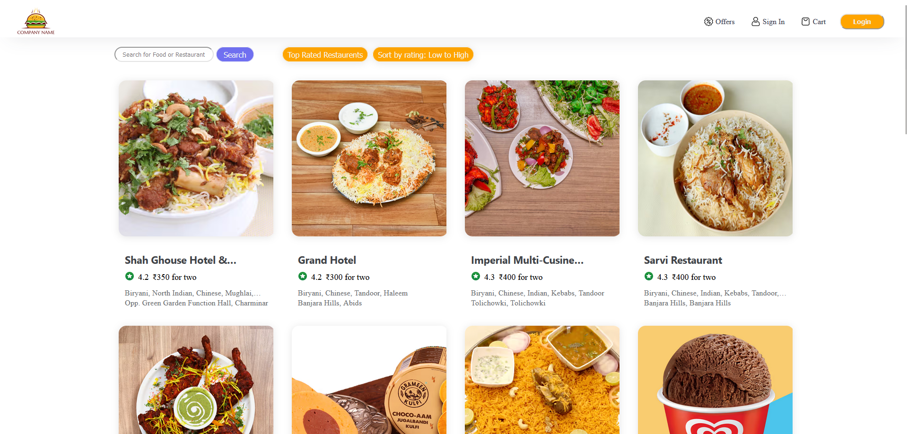
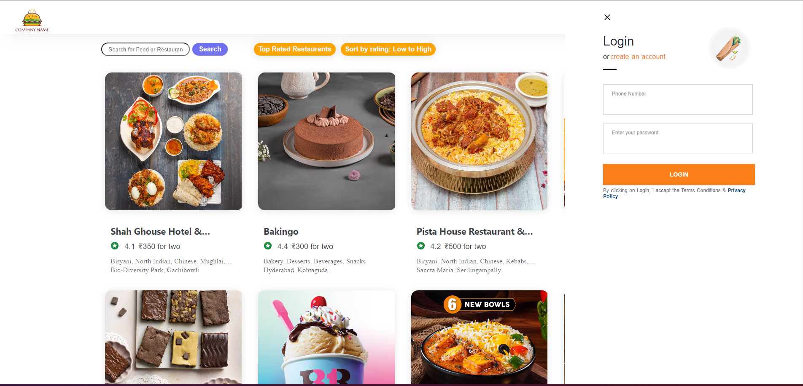
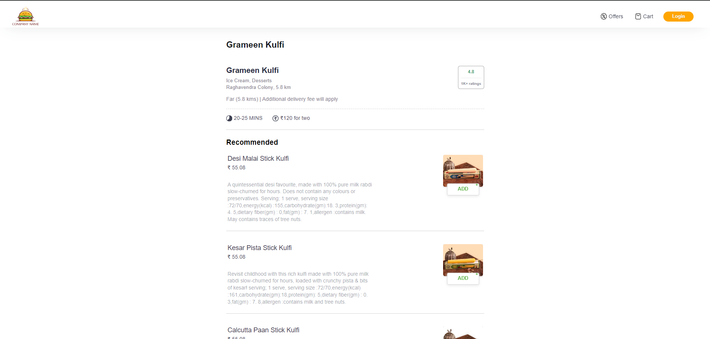
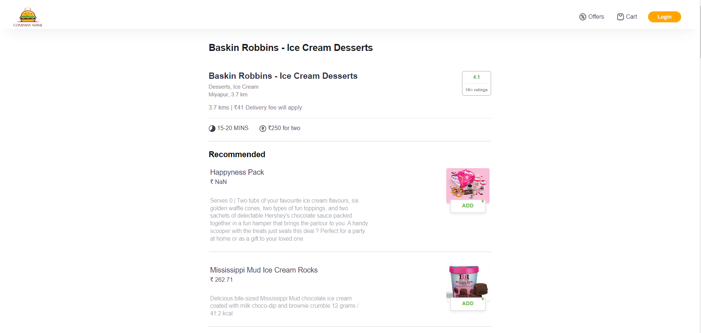

# Food Ordering React Site
### About:

This React project is a learning exercise to create a food ordering app. It allows users to browse through a selection of restaurants, view menus, sort and filter restaurants.

### Features:

Restaurant listings: Displays basic information about restaurants, including name, cuisine type, and average rating.
Menu browsing: Users can view available menu items with descriptions and prices.
Search functionality: Users can search restaurant by name or by keywords in the name.
Sort by rating functionality: Users can sort restaurant by rating for low to high
Top rated restaurants functionality: Users can filter out top rated restaurant that are above 4 star rating
Hotel/Restaurant menu page: User can go to the specific reataurant menu page form home by click and navigate functionality 

### Technologies:

React: JavaScript library for building user interfaces
CSS: Styles the frontend appearance

npm init
npm install -D parcel
npm install react
npm install react-dom
npx parcel index.html

